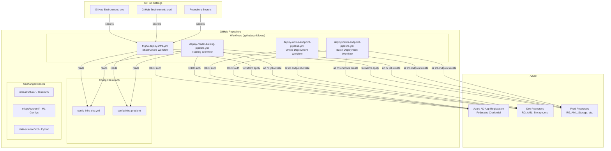
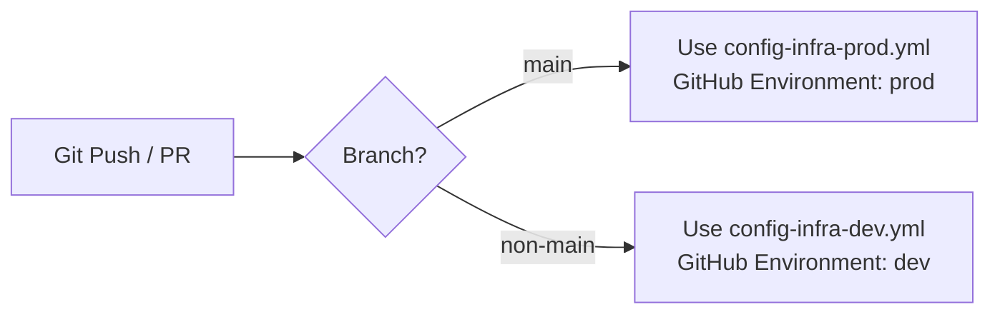

# Design Document: GitHub Actions MLOps CI/CD Migration

## Overview

This design describes the migration of CI/CD orchestration from Azure DevOps-dependent GitHub Actions workflows to fully self-contained GitHub Actions workflows. The existing workflows in `.github/workflows/` call reusable workflows from `Azure/mlops-templates` and rely on ADO-style variable template syntax in config files. The migration replaces these with:

1. Self-contained workflow YAML files that use `az cli` with the `ml` extension directly
2. GitHub-native environment config files (no `$(variable)` interpolation)
3. OIDC-based Azure authentication via `azure/login` action
4. GitHub Environments for dev/prod promotion with environment-scoped secrets

The existing Terraform code, Azure ML pipeline YAML, training environment, data assets, deployment configs, and data-science source code are not modified.

## Architecture



### Branch-Based Environment Selection



### Workflow Execution Order

The workflows are independent and manually triggered via `workflow_dispatch`. The intended execution order for a full deployment is:

1. **Infrastructure** → provisions Azure resources
2. **Training** → registers data/env, submits ML pipeline, registers model
3. **Online Deployment** → deploys model to online endpoint
4. **Batch Deployment** → deploys model to batch endpoint

## Components and Interfaces

### 1. Config Files (config-infra-dev.yml, config-infra-prod.yml)

The config files are converted from ADO variable template format to plain YAML key-value pairs. The `variables:` wrapper and `$(variable)` interpolation syntax are removed. Derived resource names are pre-computed as static strings.

**Current format (ADO):**
```yaml
variables:
  namespace: mlopsv2
  postfix: 0001
  environment: dev
  resource_group: rg-$(namespace)-$(postfix)$(environment)
```

**New format (GitHub Actions compatible):**
```yaml
namespace: mlopsv2
postfix: "0001"
environment: dev
resource_group: rg-mlopsv2-0001dev
```

Workflows load these files using a shell step that parses the YAML and exports values as environment variables or step outputs.

### 2. Config Parsing Composite Action (.github/actions/parse-config/action.yml)

A reusable composite action that:
- Accepts a config file path as input
- Parses the YAML using `yq` (pre-installed on GitHub runners)
- Exports all keys as step outputs

This avoids duplicating config-parsing logic across all four workflows.

### 3. Azure Login Step (OIDC)

Each workflow job that interacts with Azure includes:
```yaml
- uses: azure/login@v2
  with:
    client-id: ${{ secrets.AZURE_CLIENT_ID }}
    tenant-id: ${{ secrets.AZURE_TENANT_ID }}
    subscription-id: ${{ secrets.AZURE_SUBSCRIPTION_ID }}
```

The `azure/login@v2` action uses OIDC by default when `client-id` is provided instead of `creds`.

### 4. Infrastructure Workflow (tf-gha-deploy-infra.yml)

**Trigger:** `workflow_dispatch` + `push` to any branch

**Jobs:**
1. `set-env` — determines config file based on branch
2. `parse-config` — loads config values using composite action
3. `terraform` — runs init/plan/apply

**Terraform init backend config** is passed via `-backend-config` flags:
```bash
terraform init \
  -backend-config="storage_account_name=${{ steps.config.outputs.terraform_st_storage_account }}" \
  -backend-config="resource_group_name=${{ steps.config.outputs.terraform_st_resource_group }}" \
  -backend-config="container_name=${{ steps.config.outputs.terraform_st_container_name }}" \
  -backend-config="key=${{ steps.config.outputs.terraform_st_key }}"
```

**Terraform variables** are passed via `-var` flags or `TF_VAR_` environment variables.

### 5. Training Workflow (deploy-model-training-pipeline-classical.yml)

**Trigger:** `workflow_dispatch` + `push` to any branch

**Jobs (sequential):**
1. `set-env` + `parse-config` — resolve environment
2. `register-data` — `az ml data create --file mlops/azureml/train/data.yml`
3. `register-environment` — `az ml environment create --file mlops/azureml/train/train-env.yml`
4. `create-compute` — `az ml compute create` for cpu-cluster
5. `run-pipeline` — `az ml job create --file mlops/azureml/train/pipeline.yml`

All `az ml` commands target `--resource-group` and `--workspace-name` from config.

### 6. Online Deployment Workflow (deploy-online-endpoint-pipeline-classical.yml)

**Trigger:** `workflow_dispatch` + `push` to any branch

**Jobs (sequential):**
1. `set-env` + `parse-config`
2. `create-endpoint` — `az ml online-endpoint create --file mlops/azureml/deploy/online/online-endpoint.yml`
3. `create-deployment` — `az ml online-deployment create --file mlops/azureml/deploy/online/online-deployment.yml`
4. `allocate-traffic` — `az ml online-endpoint update --traffic "blue=100"`

### 7. Batch Deployment Workflow (deploy-batch-endpoint-pipeline-classical.yml)

**Trigger:** `workflow_dispatch` + `push` to any branch

**Jobs (sequential):**
1. `set-env` + `parse-config`
2. `create-compute` — `az ml compute create` for batch-cluster
3. `create-endpoint` — `az ml batch-endpoint create --file mlops/azureml/deploy/batch/batch-endpoint.yml`
4. `create-deployment` — `az ml batch-deployment create --file mlops/azureml/deploy/batch/batch-deployment.yml`

## Data Models

### Config File Schema (post-migration)

```yaml
# config-infra-{env}.yml
namespace: string          # e.g., "mlopsv2"
postfix: string            # e.g., "0001"
location: string           # e.g., "eastus"
environment: string        # e.g., "dev" or "prod"
enable_aml_computecluster: boolean
enable_monitoring: boolean

# Pre-computed resource names (no interpolation)
resource_group: string     # e.g., "rg-mlopsv2-0001dev"
aml_workspace: string      # e.g., "mlw-mlopsv2-0001dev"
application_insights: string
key_vault: string
container_registry: string
storage_account: string

# Terraform backend settings
terraform_version: string
terraform_workingdir: string
terraform_st_location: string
terraform_st_resource_group: string
terraform_st_storage_account: string
terraform_st_container_name: string
terraform_st_key: string
```

### GitHub Secrets Schema

| Secret Name | Description | Used By |
|---|---|---|
| `AZURE_CLIENT_ID` | Azure AD app registration client ID for OIDC | All workflows |
| `AZURE_TENANT_ID` | Azure AD tenant ID | All workflows |
| `AZURE_SUBSCRIPTION_ID` | Azure subscription ID | All workflows |
| `ARM_CLIENT_SECRET` | Service principal secret for Terraform | Infra workflow |

### Composite Action Interface (parse-config)

**Inputs:**
- `config-file`: path to the config YAML file

**Outputs:**
- One output per key in the config file (namespace, postfix, location, environment, resource_group, aml_workspace, etc.)

**Implementation:** Uses `yq` to read each key and set as step output.


## Correctness Properties

*A property is a characteristic or behavior that should hold true across all valid executions of a system — essentially, a formal statement about what the system should do. Properties serve as the bridge between human-readable specifications and machine-verifiable correctness guarantees.*

The following properties are derived from the acceptance criteria. Since this is a CI/CD migration involving YAML workflow files and config files (not application code), the testable properties focus on structural validation of the generated artifacts.

### Property 1: No ADO interpolation syntax in config files

*For any* key-value pair in a post-migration config file, the value SHALL NOT contain the pattern `$(...)`. This ensures all ADO variable template syntax has been removed.

**Validates: Requirements 1.1**

### Property 2: Derived resource names match naming convention

*For any* config file with base parameters (namespace, postfix, environment), the derived resource names SHALL match the expected patterns:
- `resource_group` = `rg-{namespace}-{postfix}{environment}`
- `aml_workspace` = `mlw-{namespace}-{postfix}{environment}`
- `key_vault` = `kv-{namespace}-{postfix}{environment}`
- `container_registry` = `cr{namespace}{postfix}{environment}`
- `storage_account` = `st{namespace}{postfix}{environment}`

**Validates: Requirements 1.2**

### Property 3: Branch-based environment selection

*For any* Git branch name, the environment selection logic SHALL output `config-infra-prod.yml` if and only if the branch is `main`. For all other branch names, it SHALL output `config-infra-dev.yml`.

**Validates: Requirements 1.3, 3.4, 3.5, 4.7, 4.8, 5.6, 5.7, 6.6, 6.7**

### Property 4: All workflows use OIDC authentication from secrets

*For any* workflow file in `.github/workflows/`, every job that authenticates to Azure SHALL use the `azure/login` action with `client-id`, `tenant-id`, and `subscription-id` inputs sourced from `secrets.*` expressions.

**Validates: Requirements 2.1, 2.2, 7.1**

### Property 5: No hardcoded credentials in workflow or config files

*For any* file in `.github/workflows/` or root-level config files, the file content SHALL NOT contain hardcoded Azure subscription IDs, tenant IDs, client IDs, or client secrets (patterns matching GUID format in credential positions or known secret patterns).

**Validates: Requirements 2.4, 7.3**

### Property 6: All workflows support manual triggering

*For any* workflow file in `.github/workflows/`, the `on:` trigger section SHALL include `workflow_dispatch`.

**Validates: Requirements 3.7, 4.6, 5.5, 6.5**

### Property 7: All az ml commands use config-derived resource group and workspace

*For any* `az ml` command in any workflow file, the command SHALL include `--resource-group` and `--workspace-name` flags with values sourced from the config parsing step outputs (not hardcoded).

**Validates: Requirements 4.5, 5.4, 6.4**

## Error Handling

### Workflow-Level Error Handling

- Each workflow job uses `set -e` in shell steps (default for GitHub Actions `run` steps) so any command failure stops the job immediately.
- The `azure/login` action fails the step if OIDC authentication fails, which stops the job.
- Terraform steps use `terraform plan -detailed-exitcode` to distinguish between "no changes" and "error" states.
- `az ml` commands return non-zero exit codes on failure, which GitHub Actions surfaces as job failures.

### Config Parsing Error Handling

- The composite action validates that the config file exists before parsing.
- If `yq` fails to parse a key, the step fails and the workflow stops.

### Missing Secrets

- GitHub Actions surfaces missing secrets as empty strings. The `azure/login` action will fail with an authentication error if secrets are empty.
- For Terraform, missing `ARM_CLIENT_SECRET` will cause `terraform plan` to fail with an Azure provider authentication error.

## Testing Strategy

Since this migration produces YAML workflow files and config files (not application code), the testing approach focuses on structural validation of the generated artifacts.

### Unit Tests (Example-Based)

Validate specific structural expectations of each workflow file:

- **Infra workflow**: Contains terraform init, plan, apply steps with correct backend-config flags
- **Training workflow**: Contains az ml data create, az ml environment create, az ml compute create, az ml job create steps referencing correct YAML files
- **Online deployment workflow**: Contains endpoint create, deployment create, traffic allocation steps
- **Batch deployment workflow**: Contains compute create, endpoint create, deployment create steps
- **Config files**: Contain expected static values (namespace=mlopsv2, postfix=0001, etc.)

### Property-Based Tests

Use a property-based testing library to validate universal properties across all generated files:

- **Library**: `pytest` with `hypothesis` for Python-based validation scripts
- **Minimum iterations**: 100 per property test
- **Tag format**: `Feature: github-actions-mlops-cicd, Property {N}: {title}`

Property tests validate:
1. Config file syntax (no ADO interpolation) — Property 1
2. Naming convention consistency — Property 2
3. Branch selection logic — Property 3
4. OIDC auth structure across all workflows — Property 4
5. No credential leakage — Property 5
6. workflow_dispatch presence — Property 6
7. Config-derived parameters in az ml commands — Property 7

### Integration Testing

Integration testing requires an actual Azure subscription and is out of scope for automated CI tests. Manual validation steps:

1. Run infra workflow against a test subscription
2. Run training workflow and verify pipeline job appears in AML workspace
3. Run online deployment workflow and verify endpoint responds
4. Run batch deployment workflow and verify batch endpoint exists
